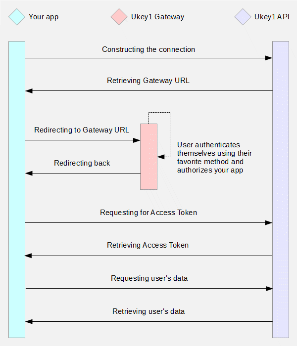

# Ukey1 for Developers - How it works

Ukey1 works basically like any other identity provider you may know. The flow is based on [OAuth 2.0](https://oauth.net/2/) with custom improvements.

## Authentication flow

In few words...

You need to construct the connection. It's recommended to do that via server-side request rather than client-side request. In the request you send us wanted permissions and your redirect URL. In the response you will get unique URL of our gateway. You need to redirect the user to that URL.

On the side of Ukey1 Gateway, the user signs in using their favorite method (via Facebook, Google, Linkedin, email or nickname) if they're not authenticated already. The whole authentication process is operated by Ukey1 - it means, you don't need to create accounts with all identity providers. The next step is authorization of your app. Based on permissions you choose, the user has to authorize access to their personal data. This step is necessary to get positive opt-in with respect to GDPR.

Then the user is redirected back to your app to specified URL. You can request for access token using the one-time code that has been injected as a GET parameter of your URL. When you have access token, you can request user's personal data.

-----

[Home](../../README.md) | [How it works](../HowItWorks/README.md) | [Permissions](../Permissions/README.md) | [Security](../Security/README.md) | [FAQ](../FAQ/README.md)
